# Exo-RKLLAMA Architecture

Comprehensive architecture documentation with visual diagrams for the exo distributed inference framework.

## Table of Contents

1. [System Overview](#system-overview)
2. [Network Topology](#network-topology)
3. [Component Interaction](#component-interaction)
4. [Request Data Flow](#request-data-flow)
5. [Storage & Monitoring](#storage--monitoring)
6. [RKLLM Engine Architecture](#rkllm-engine-architecture)
7. [Multi-Node Distribution](#multi-node-distribution)

---

## System Overview

Exo is a peer-to-peer distributed LLM inference framework with no master-worker hierarchy. All nodes are equal peers that discover each other and collaborate to run inference across heterogeneous devices.

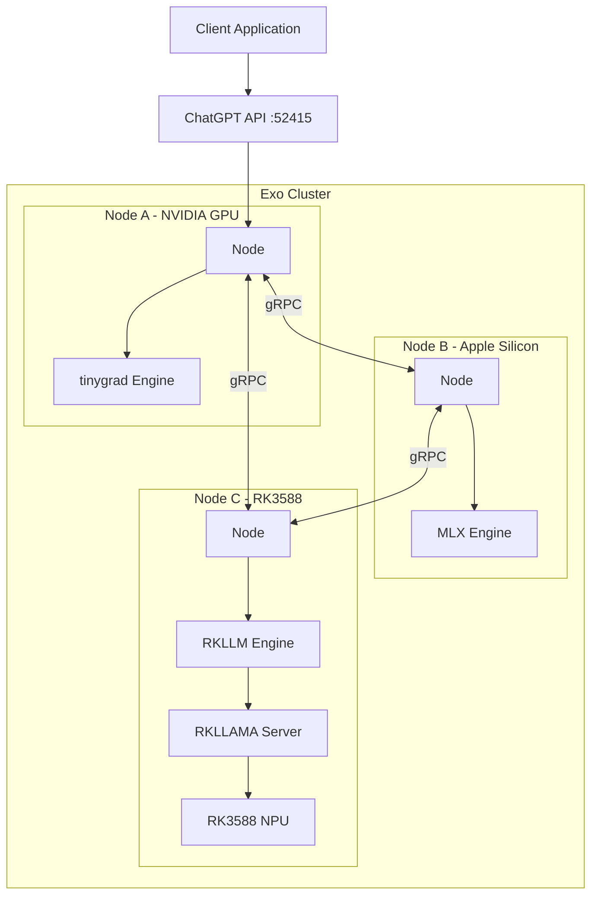
```mermaid
graph TB
    subgraph "Exo Cluster"
        subgraph "Node A - NVIDIA GPU"
            NA[Node]
            EA[tinygrad Engine]
        end
        subgraph "Node B - Apple Silicon"
            NB[Node]
            EB[MLX Engine]
        end
        subgraph "Node C - RK3588"
            NC[Node]
            EC[RKLLM Engine]
            RS[RKLLAMA Server]
            NPU[RK3588 NPU]
        end
    end

    Client[Client Application] --> API[ChatGPT API :52415]
    API --> NA

    NA <-->|gRPC| NB
    NB <-->|gRPC| NC
    NA <-->|gRPC| NC

    EC --> RS
    RS --> NPU

    NA --> EA
    NB --> EB
    NC --> EC
```

### Key Characteristics

| Feature | Description |
|---------|-------------|
| **Architecture** | Peer-to-peer (no master node) |
| **API** | ChatGPT-compatible at `:52415` |
| **Discovery** | UDP broadcast, Tailscale, or manual config |
| **Communication** | gRPC with 256MB message support |
| **Partitioning** | Memory-weighted layer distribution |

---

## Network Topology

### Discovery Modes

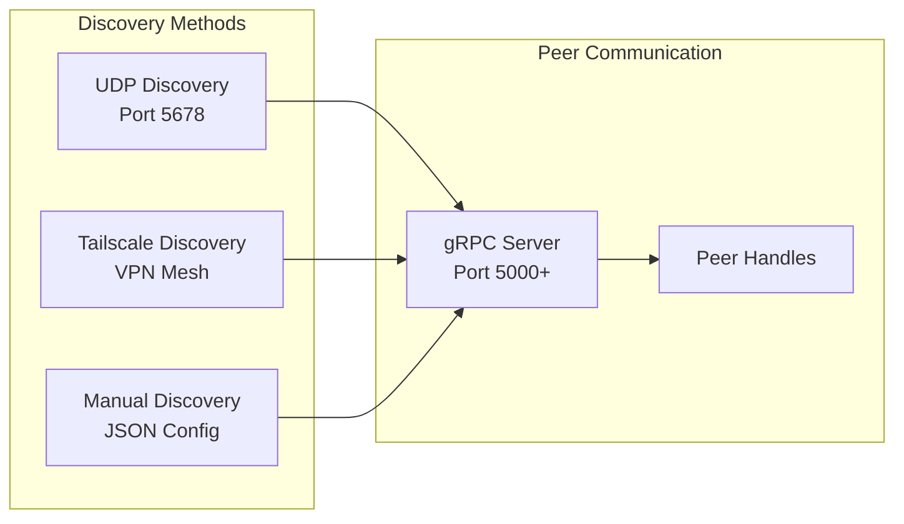
```mermaid
flowchart LR
    subgraph "Discovery Methods"
        direction TB
        UDP[UDP Discovery<br/>Port 5678]
        TS[Tailscale Discovery<br/>VPN Mesh]
        MAN[Manual Discovery<br/>JSON Config]
    end

    subgraph "Peer Communication"
        direction TB
        GRPC[gRPC Server<br/>Port 5000+]
        PH[Peer Handles]
    end

    UDP --> GRPC
    TS --> GRPC
    MAN --> GRPC
    GRPC --> PH
```

### UDP Discovery Flow

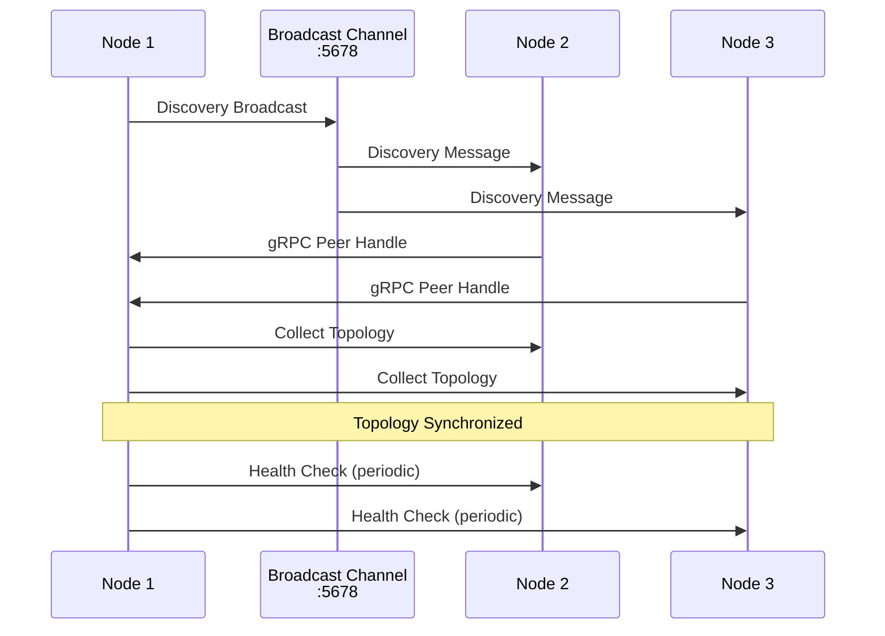
```mermaid
sequenceDiagram
    participant N1 as Node 1
    participant BC as Broadcast Channel<br/>:5678
    participant N2 as Node 2
    participant N3 as Node 3

    N1->>BC: Discovery Broadcast
    BC->>N2: Discovery Message
    BC->>N3: Discovery Message

    N2->>N1: gRPC Peer Handle
    N3->>N1: gRPC Peer Handle

    N1->>N2: Collect Topology
    N1->>N3: Collect Topology

    Note over N1,N3: Topology Synchronized

    N1->>N2: Health Check (periodic)
    N1->>N3: Health Check (periodic)
```

### gRPC Communication

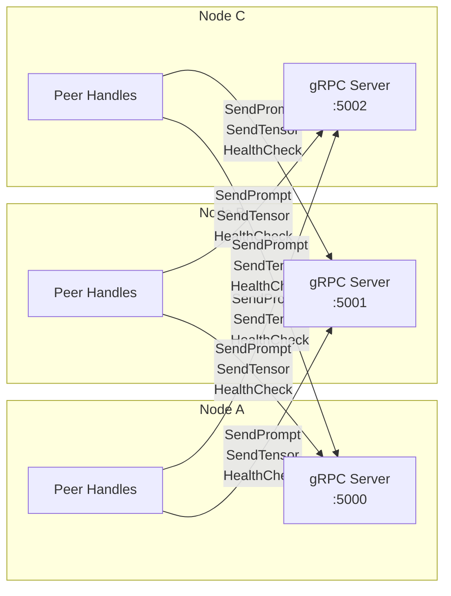
```mermaid
graph LR
    subgraph "Node A"
        SA[gRPC Server<br/>:5000]
        PA[Peer Handles]
    end

    subgraph "Node B"
        SB[gRPC Server<br/>:5001]
        PB[Peer Handles]
    end

    subgraph "Node C"
        SC[gRPC Server<br/>:5002]
        PC[Peer Handles]
    end

    PA -->|SendPrompt<br/>SendTensor<br/>HealthCheck| SB
    PA -->|SendPrompt<br/>SendTensor<br/>HealthCheck| SC
    PB -->|SendPrompt<br/>SendTensor<br/>HealthCheck| SA
    PB -->|SendPrompt<br/>SendTensor<br/>HealthCheck| SC
    PC -->|SendPrompt<br/>SendTensor<br/>HealthCheck| SA
    PC -->|SendPrompt<br/>SendTensor<br/>HealthCheck| SB
```

### Network Ports

| Port | Protocol | Service | Description |
|------|----------|---------|-------------|
| 52415 | HTTP | ChatGPT API | Client-facing REST API |
| 5678 | UDP | Discovery | Peer discovery broadcasts |
| 5000+ | gRPC | Peer Comm | Inter-node communication |
| 8080 | HTTP | RKLLAMA | NPU inference server |
| 9090 | HTTP | Prometheus | Metrics collection |
| 3000 | HTTP | Grafana | Metrics visualization |

---

## Component Interaction

### Core Module Architecture

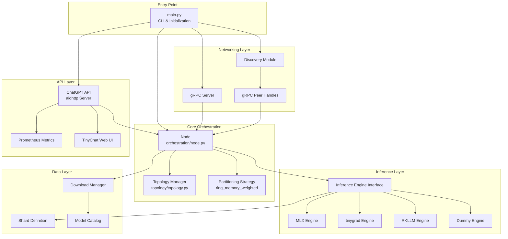
```mermaid
graph TB
    subgraph "Entry Point"
        MAIN[main.py<br/>CLI & Initialization]
    end

    subgraph "Core Orchestration"
        NODE[Node<br/>orchestration/node.py]
        TOPO[Topology Manager<br/>topology/topology.py]
        PART[Partitioning Strategy<br/>ring_memory_weighted]
    end

    subgraph "Networking Layer"
        DISC[Discovery Module]
        GRPCS[gRPC Server]
        GRPCP[gRPC Peer Handles]
    end

    subgraph "Inference Layer"
        IE[Inference Engine Interface]
        MLX[MLX Engine]
        TG[tinygrad Engine]
        RK[RKLLM Engine]
        DUMMY[Dummy Engine]
    end

    subgraph "API Layer"
        CHAT[ChatGPT API<br/>aiohttp Server]
        METRICS[Prometheus Metrics]
        WEBCHAT[TinyChat Web UI]
    end

    subgraph "Data Layer"
        DL[Download Manager]
        SHARD[Shard Definition]
        MODELS[Model Catalog]
    end

    MAIN --> NODE
    MAIN --> DISC
    MAIN --> GRPCS
    MAIN --> CHAT

    NODE --> TOPO
    NODE --> PART
    NODE --> IE

    DISC --> GRPCP
    GRPCS --> NODE
    GRPCP --> NODE

    IE --> MLX
    IE --> TG
    IE --> RK
    IE --> DUMMY

    CHAT --> NODE
    CHAT --> METRICS
    CHAT --> WEBCHAT

    NODE --> DL
    DL --> MODELS
    IE --> SHARD
```

### Inference Engine Interface

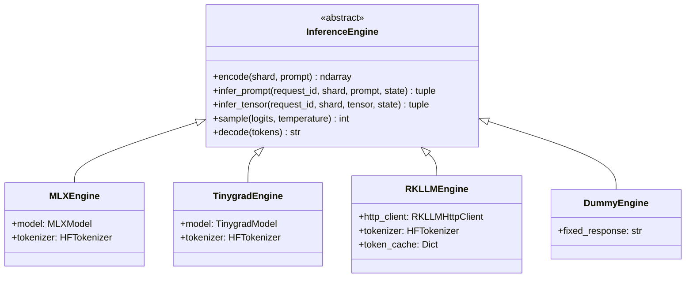
```mermaid
classDiagram
    class InferenceEngine {
        <<abstract>>
        +encode(shard, prompt) ndarray
        +infer_prompt(request_id, shard, prompt, state) tuple
        +infer_tensor(request_id, shard, tensor, state) tuple
        +sample(logits, temperature) int
        +decode(tokens) str
    }

    class MLXEngine {
        +model: MLXModel
        +tokenizer: HFTokenizer
    }

    class TinygradEngine {
        +model: TinygradModel
        +tokenizer: HFTokenizer
    }

    class RKLLMEngine {
        +http_client: RKLLMHttpClient
        +tokenizer: HFTokenizer
        +token_cache: Dict
    }

    class DummyEngine {
        +fixed_response: str
    }

    InferenceEngine <|-- MLXEngine
    InferenceEngine <|-- TinygradEngine
    InferenceEngine <|-- RKLLMEngine
    InferenceEngine <|-- DummyEngine
```

### Shard Representation

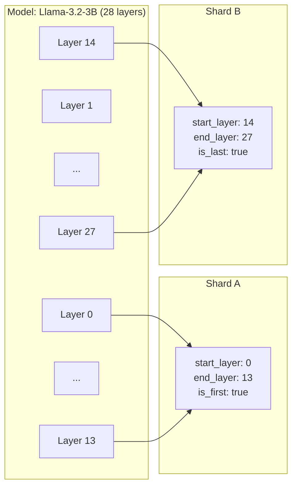
```mermaid
graph LR
    subgraph "Model: Llama-3.2-3B (28 layers)"
        L0[Layer 0]
        L1[Layer 1]
        L2[...]
        L13[Layer 13]
        L14[Layer 14]
        L15[...]
        L27[Layer 27]
    end

    subgraph "Shard A"
        SA[start_layer: 0<br/>end_layer: 13<br/>is_first: true]
    end

    subgraph "Shard B"
        SB[start_layer: 14<br/>end_layer: 27<br/>is_last: true]
    end

    L0 --> SA
    L13 --> SA
    L14 --> SB
    L27 --> SB
```

---

## Request Data Flow

### Chat Completion Request Lifecycle

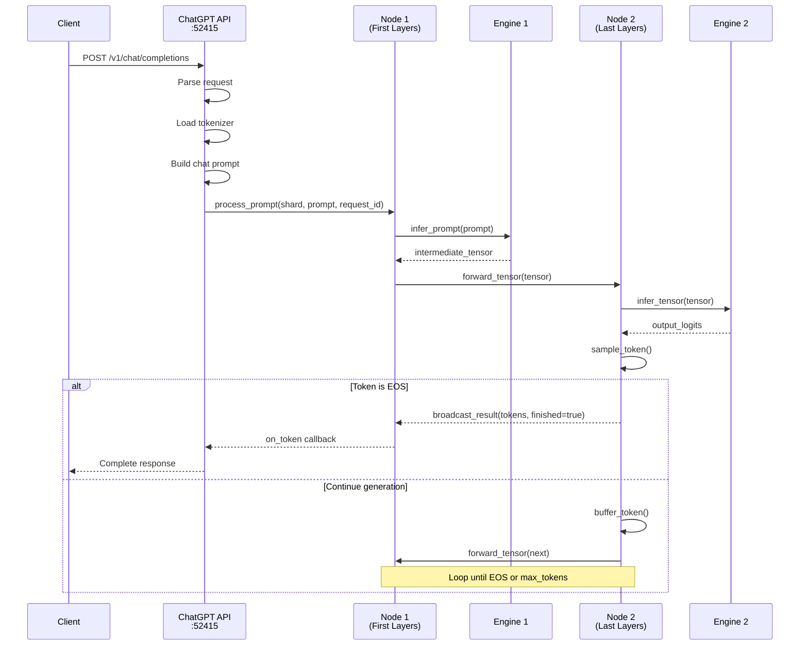
```mermaid
sequenceDiagram
    participant C as Client
    participant API as ChatGPT API<br/>:52415
    participant N1 as Node 1<br/>(First Layers)
    participant E1 as Engine 1
    participant N2 as Node 2<br/>(Last Layers)
    participant E2 as Engine 2

    C->>API: POST /v1/chat/completions
    API->>API: Parse request
    API->>API: Load tokenizer
    API->>API: Build chat prompt
    API->>N1: process_prompt(shard, prompt, request_id)

    N1->>E1: infer_prompt(prompt)
    E1-->>N1: intermediate_tensor
    N1->>N2: forward_tensor(tensor)

    N2->>E2: infer_tensor(tensor)
    E2-->>N2: output_logits
    N2->>N2: sample_token()

    alt Token is EOS
        N2-->>N1: broadcast_result(tokens, finished=true)
        N1-->>API: on_token callback
        API-->>C: Complete response
    else Continue generation
        N2->>N2: buffer_token()
        N2->>N1: forward_tensor(next)
        Note over N1,N2: Loop until EOS or max_tokens
    end
```

### Streaming Response Flow

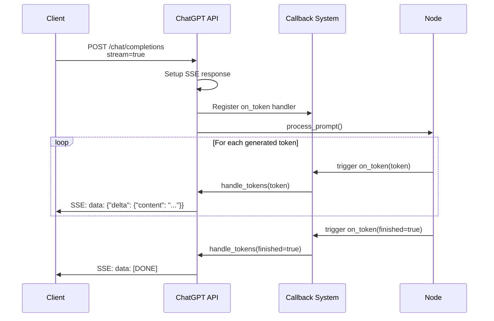
```mermaid
sequenceDiagram
    participant C as Client
    participant API as ChatGPT API
    participant CB as Callback System
    participant N as Node

    C->>API: POST /chat/completions<br/>stream=true
    API->>API: Setup SSE response
    API->>CB: Register on_token handler
    API->>N: process_prompt()

    loop For each generated token
        N->>CB: trigger on_token(token)
        CB->>API: handle_tokens(token)
        API->>C: SSE: data: {"delta": {"content": "..."}}
    end

    N->>CB: trigger on_token(finished=true)
    CB->>API: handle_tokens(finished=true)
    API->>C: SSE: data: [DONE]
```

### Node Request State Machine

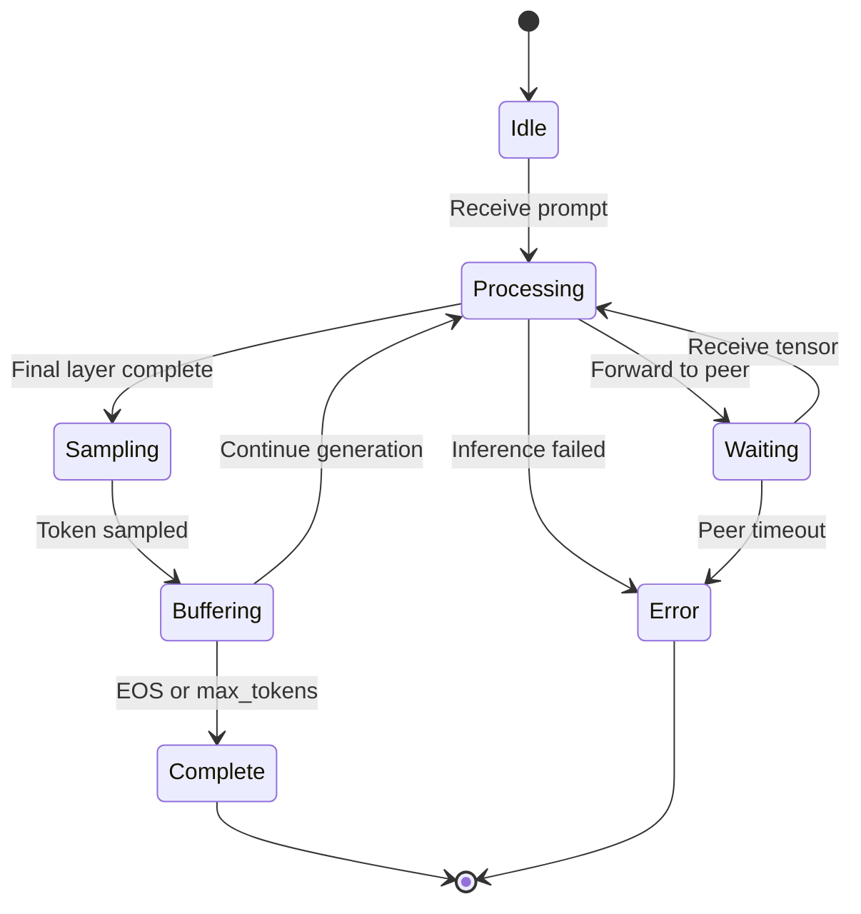
```mermaid
stateDiagram-v2
    [*] --> Idle

    Idle --> Processing: Receive prompt
    Processing --> Waiting: Forward to peer
    Waiting --> Processing: Receive tensor
    Processing --> Sampling: Final layer complete
    Sampling --> Buffering: Token sampled
    Buffering --> Processing: Continue generation
    Buffering --> Complete: EOS or max_tokens
    Complete --> [*]

    Processing --> Error: Inference failed
    Waiting --> Error: Peer timeout
    Error --> [*]
```

---

## Storage & Monitoring

### Model Storage Architecture

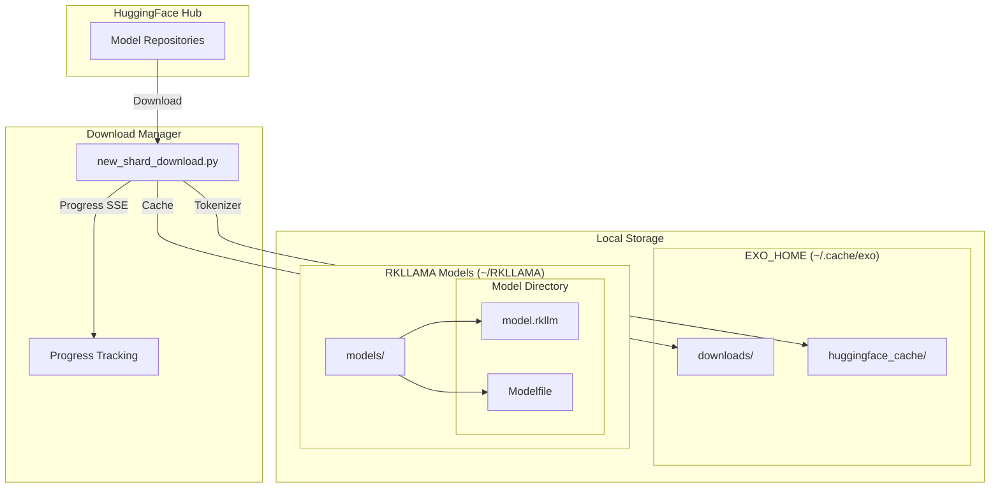
```mermaid
graph TB
    subgraph "HuggingFace Hub"
        HF[Model Repositories]
    end

    subgraph "Local Storage"
        subgraph "EXO_HOME (~/.cache/exo)"
            DL[downloads/]
            HFC[huggingface_cache/]
        end

        subgraph "RKLLAMA Models (~/RKLLAMA)"
            MODELS[models/]
            subgraph "Model Directory"
                RKLLM[model.rkllm]
                MF[Modelfile]
            end
        end
    end

    subgraph "Download Manager"
        DM[new_shard_download.py]
        PROG[Progress Tracking]
    end

    HF -->|Download| DM
    DM -->|Cache| DL
    DM -->|Tokenizer| HFC
    DM -->|Progress SSE| PROG

    MODELS --> RKLLM
    MODELS --> MF
```

### Monitoring Data Flow

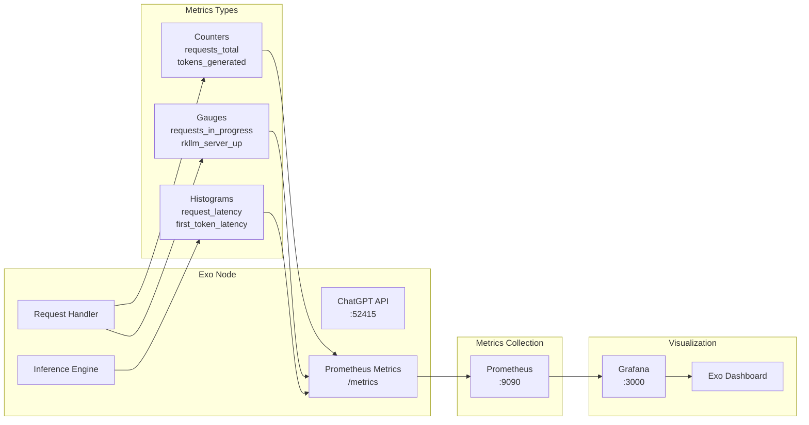
```mermaid
graph LR
    subgraph "Exo Node"
        API[ChatGPT API<br/>:52415]
        MET[Prometheus Metrics<br/>/metrics]
        REQ[Request Handler]
        ENG[Inference Engine]
    end

    subgraph "Metrics Collection"
        PROM[Prometheus<br/>:9090]
    end

    subgraph "Visualization"
        GRAF[Grafana<br/>:3000]
        DASH[Exo Dashboard]
    end

    subgraph "Metrics Types"
        CNT[Counters<br/>requests_total<br/>tokens_generated]
        GAU[Gauges<br/>requests_in_progress<br/>rkllm_server_up]
        HIS[Histograms<br/>request_latency<br/>first_token_latency]
    end

    REQ --> CNT
    REQ --> GAU
    ENG --> HIS

    CNT --> MET
    GAU --> MET
    HIS --> MET

    MET --> PROM
    PROM --> GRAF
    GRAF --> DASH
```

### Prometheus Metrics Architecture

```mermaid
graph TB
    subgraph "Application Layer"
        CHAT[ChatGPT API Handler]
        NODE[Node Orchestrator]
        RKENG[RKLLM Engine]
    end

    subgraph "Metrics Layer"
        subgraph "Request Metrics"
            RT[requests_total]
            RIP[requests_in_progress]
            RL[request_latency_seconds]
            FTL[first_token_latency_seconds]
        end

        subgraph "Token Metrics"
            TG[tokens_generated_total]
            PT[prompt_tokens_total]
        end

        subgraph "RKLLM Metrics"
            RSU[rkllm_server_up]
            RID[rkllm_inference_duration]
            RML[rkllm_model_load_duration]
        end

        subgraph "Error Metrics"
            ET[errors_total]
        end
    end

    subgraph "Exposition"
        EXP[/metrics endpoint<br/>Prometheus format]
    end

    CHAT --> RT
    CHAT --> RIP
    CHAT --> RL
    CHAT --> FTL
    CHAT --> ET

    NODE --> TG
    NODE --> PT

    RKENG --> RSU
    RKENG --> RID
    RKENG --> RML

    RT --> EXP
    RIP --> EXP
    RL --> EXP
    TG --> EXP
    RSU --> EXP
```

---

## RKLLM Engine Architecture

### RKLLM Communication Flow

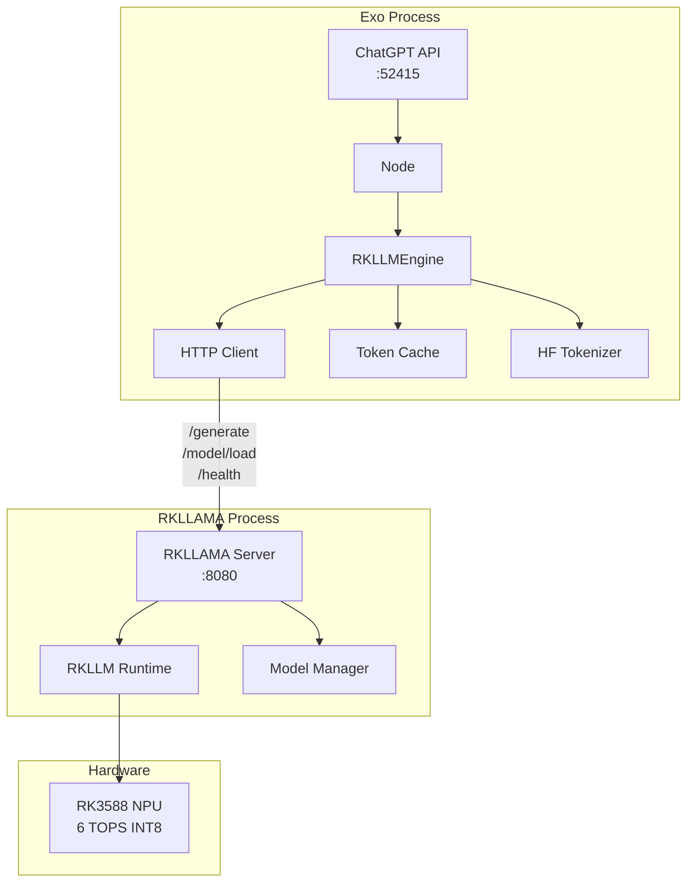
```mermaid
graph TB
    subgraph "Exo Process"
        API[ChatGPT API<br/>:52415]
        NODE[Node]
        ENG[RKLLMEngine]
        HTTP[HTTP Client]
        CACHE[Token Cache]
        TOK[HF Tokenizer]
    end

    subgraph "RKLLAMA Process"
        SRV[RKLLAMA Server<br/>:8080]
        RT[RKLLM Runtime]
        MDL[Model Manager]
    end

    subgraph "Hardware"
        NPU[RK3588 NPU<br/>6 TOPS INT8]
    end

    API --> NODE
    NODE --> ENG
    ENG --> HTTP
    ENG --> CACHE
    ENG --> TOK

    HTTP -->|/generate<br/>/model/load<br/>/health| SRV
    SRV --> RT
    SRV --> MDL
    RT --> NPU
```

### RKLLM Token Generation Strategy

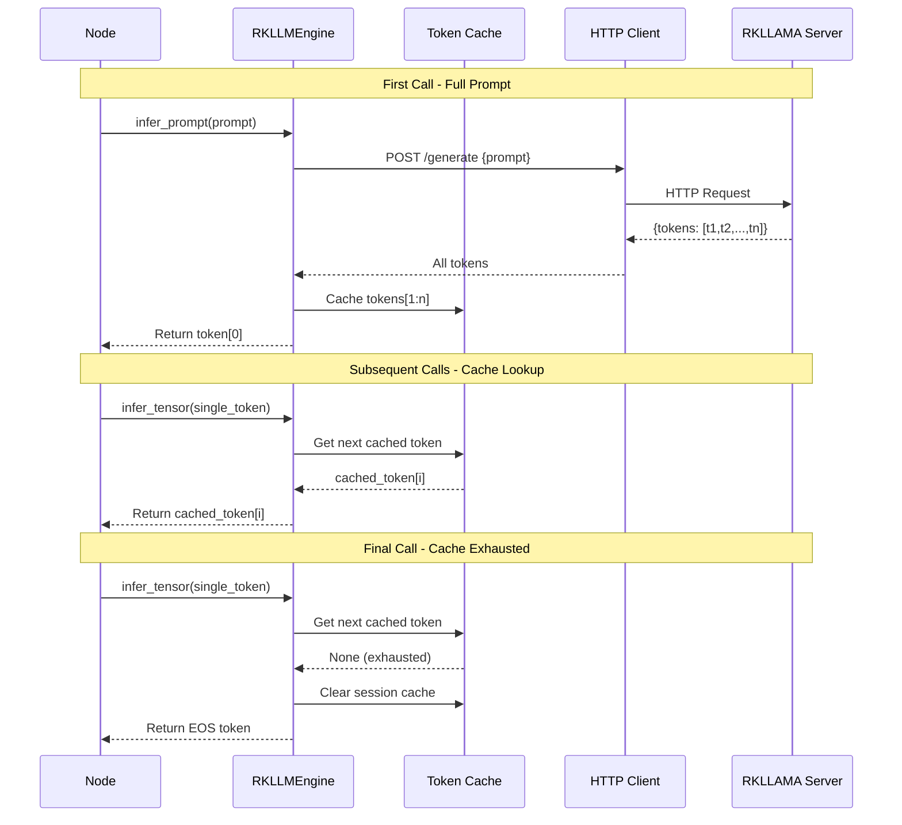
```mermaid
sequenceDiagram
    participant N as Node
    participant E as RKLLMEngine
    participant C as Token Cache
    participant H as HTTP Client
    participant S as RKLLAMA Server

    Note over N,S: First Call - Full Prompt
    N->>E: infer_prompt(prompt)
    E->>H: POST /generate {prompt}
    H->>S: HTTP Request
    S-->>H: {tokens: [t1,t2,...,tn]}
    H-->>E: All tokens
    E->>C: Cache tokens[1:n]
    E-->>N: Return token[0]

    Note over N,S: Subsequent Calls - Cache Lookup
    N->>E: infer_tensor(single_token)
    E->>C: Get next cached token
    C-->>E: cached_token[i]
    E-->>N: Return cached_token[i]

    Note over N,S: Final Call - Cache Exhausted
    N->>E: infer_tensor(single_token)
    E->>C: Get next cached token
    C-->>E: None (exhausted)
    E->>C: Clear session cache
    E-->>N: Return EOS token
```

### RKLLM vs Distributed Sharding

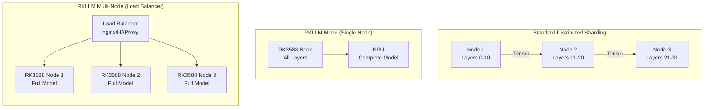
```mermaid
graph TB
    subgraph "Standard Distributed Sharding"
        direction LR
        N1A[Node 1<br/>Layers 0-10]
        N2A[Node 2<br/>Layers 11-20]
        N3A[Node 3<br/>Layers 21-31]
        N1A -->|Tensor| N2A
        N2A -->|Tensor| N3A
    end

    subgraph "RKLLM Mode (Single Node)"
        direction LR
        N1B[RK3588 Node<br/>All Layers]
        NPU1[NPU<br/>Complete Model]
        N1B --> NPU1
    end

    subgraph "RKLLM Multi-Node (Load Balancer)"
        direction TB
        LB[Load Balancer<br/>nginx/HAProxy]
        N1C[RK3588 Node 1<br/>Full Model]
        N2C[RK3588 Node 2<br/>Full Model]
        N3C[RK3588 Node 3<br/>Full Model]
        LB --> N1C
        LB --> N2C
        LB --> N3C
    end
```

---

## Multi-Node Distribution

### Memory-Weighted Partitioning

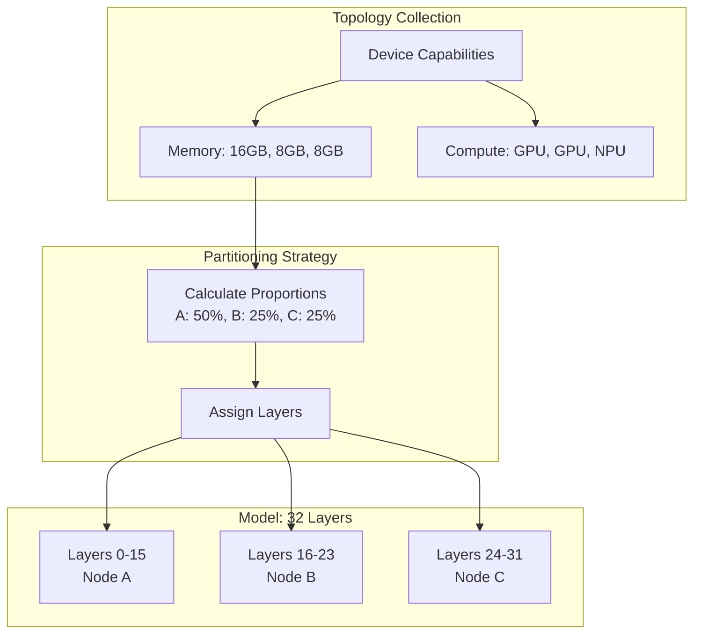
```mermaid
graph TB
    subgraph "Topology Collection"
        DC[Device Capabilities]
        MEM[Memory: 16GB, 8GB, 8GB]
        COMP[Compute: GPU, GPU, NPU]
    end

    subgraph "Partitioning Strategy"
        CALC[Calculate Proportions<br/>A: 50%, B: 25%, C: 25%]
        ASSIGN[Assign Layers]
    end

    subgraph "Model: 32 Layers"
        L1[Layers 0-15<br/>Node A]
        L2[Layers 16-23<br/>Node B]
        L3[Layers 24-31<br/>Node C]
    end

    DC --> MEM
    DC --> COMP
    MEM --> CALC
    CALC --> ASSIGN
    ASSIGN --> L1
    ASSIGN --> L2
    ASSIGN --> L3
```

### Ring Topology Data Flow

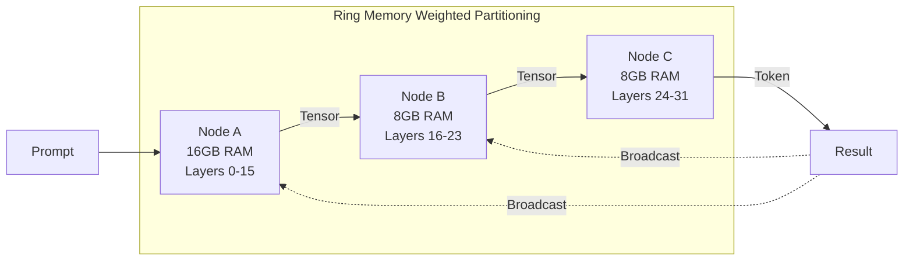
```mermaid
graph LR
    subgraph "Ring Memory Weighted Partitioning"
        direction TB
        A[Node A<br/>16GB RAM<br/>Layers 0-15]
        B[Node B<br/>8GB RAM<br/>Layers 16-23]
        C[Node C<br/>8GB RAM<br/>Layers 24-31]
    end

    P[Prompt] --> A
    A -->|Tensor| B
    B -->|Tensor| C
    C -->|Token| R[Result]

    R -.->|Broadcast| A
    R -.->|Broadcast| B
```

### Complete Cluster Overview

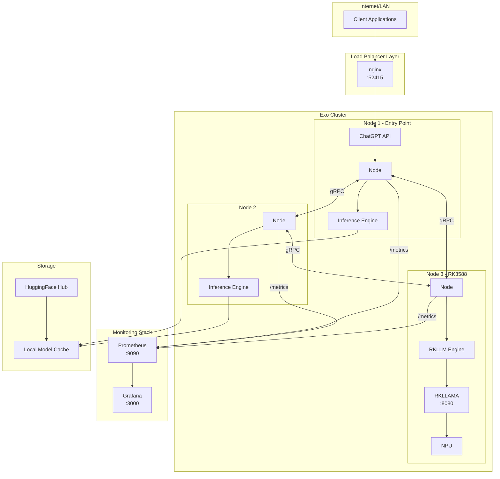
```mermaid
graph TB
    subgraph "Internet/LAN"
        CLIENT[Client Applications]
    end

    subgraph "Load Balancer Layer"
        LB[nginx<br/>:52415]
    end

    subgraph "Exo Cluster"
        subgraph "Node 1 - Entry Point"
            API1[ChatGPT API]
            N1[Node]
            E1[Inference Engine]
        end

        subgraph "Node 2"
            N2[Node]
            E2[Inference Engine]
        end

        subgraph "Node 3 - RK3588"
            N3[Node]
            E3[RKLLM Engine]
            RS[RKLLAMA<br/>:8080]
            NPU[NPU]
        end
    end

    subgraph "Monitoring Stack"
        PROM[Prometheus<br/>:9090]
        GRAF[Grafana<br/>:3000]
    end

    subgraph "Storage"
        HF[HuggingFace Hub]
        LOCAL[Local Model Cache]
    end

    CLIENT --> LB
    LB --> API1

    API1 --> N1
    N1 <-->|gRPC| N2
    N2 <-->|gRPC| N3
    N1 <-->|gRPC| N3

    N1 --> E1
    N2 --> E2
    N3 --> E3
    E3 --> RS
    RS --> NPU

    N1 -->|/metrics| PROM
    N2 -->|/metrics| PROM
    N3 -->|/metrics| PROM
    PROM --> GRAF

    E1 --> LOCAL
    E2 --> LOCAL
    HF --> LOCAL
```

---

## File Reference

### Key Source Files

| Component | File Path | Description |
|-----------|-----------|-------------|
| Entry Point | `exo/main.py` | CLI, initialization |
| Node | `exo/orchestration/node.py` | Core orchestration |
| ChatGPT API | `exo/api/chatgpt_api.py` | REST API server |
| Metrics | `exo/api/prometheus_metrics.py` | Prometheus exposition |
| Discovery | `exo/networking/udp/udp_discovery.py` | UDP peer discovery |
| gRPC Server | `exo/networking/grpc/grpc_server.py` | Peer communication |
| Inference Interface | `exo/inference/inference_engine.py` | Engine abstract class |
| RKLLM Engine | `exo/inference/rkllm/rkllm_engine.py` | RK3588 NPU engine |
| Shard | `exo/inference/shard.py` | Model partition definition |
| Topology | `exo/topology/topology.py` | Cluster graph |
| Partitioning | `exo/topology/ring_memory_weighted_partitioning_strategy.py` | Layer distribution |
| Model Catalog | `exo/models.py` | Supported models |
| Download | `exo/download/new_shard_download.py` | HuggingFace downloads |

---

## See Also

- [Deployment Guide](DEPLOYMENT.md) - Complete setup instructions
- [RKLLM Engine Details](../exo/inference/rkllm/README.md) - NPU-specific documentation
- [Nginx Load Balancer](../nginx/README.md) - Multi-node request distribution
- [Systemd Services](../systemd/README.md) - Auto-start configuration
